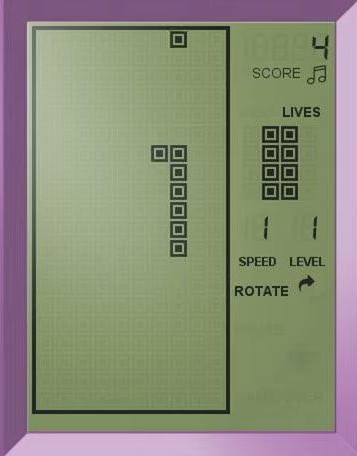
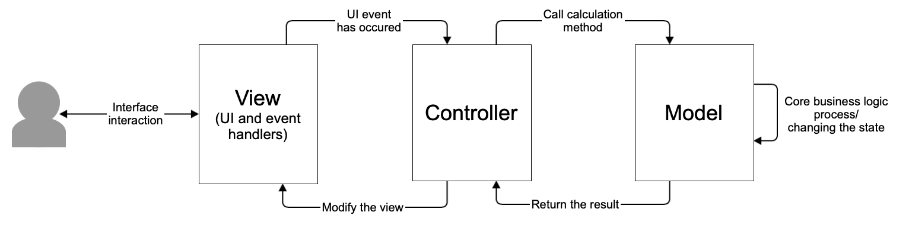
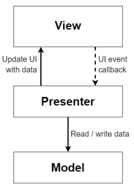
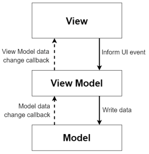

# BrickGame Snake

Summary: In this project, you will implement the Snake game in C++ using the object-oriented programming paradigm.

## Contents

- [BrickGame Snake](#brickgame-snake)
  - [Contents](#contents)
  - [Introduction](#introduction)
- [Chapter I](#chapter-i)
  - [General Information](#general-information)
    - [Snake](#snake)
    - [MVC Pattern](#mvc-pattern)
    - [MVP Pattern](#mvp-pattern)
    - [MVVM Pattern](#mvvm-pattern)
- [Chapter II](#chapter-ii)
  - [Project Requirements](#project-requirements)
    - [Part 1. Main Task](#part-1-main-task)
    - [Part 2. Bonus. Scoring and High Score](#part-2-bonus-scoring-and-high-score)
    - [Part 3. Bonus. Level Mechanics](#part-3-bonus-level-mechanics)

## Introduction

To implement the Snake game, the project consists of two separate components: a library responsible for the game logic and a desktop graphical interface.

The developed library must also be connected to the console interface from BrickGame v1.0. The console interface must fully support the new game.

The Tetris game developed in BrickGame v1.0 must be connected to the desktop interface developed in this project. It must fully support the game.

## Chapter I

## General Information

### Snake

The player controls a snake that moves forward continuously. The player changes the snake's direction using the arrow keys. The goal of the game is to collect "apples" that appear on the playing field. The player must not hit the walls of the playing field. After eating an "apple", the snake's length increases by one. The player wins if the snake reaches the maximum size (200 "pixels"). If the snake hits the boundary of the playing field, the player loses.

The game was based on another game called Blockage, in which two players controlled characters that left trails that could not be crashed into. The player who lasted longer won. In 1977, Atari released Worm, a single-player version of the game. The most popular version is arguably the 1997 release by the Swedish company Nokia for the Nokia 6110 phone, developed by Taneli Armanto.

### MVC Pattern

The MVC (Model-View-Controller) pattern is a scheme for dividing an application into three separate macro-components: the model, which contains the business logic; the view, which is the user interface for interacting with the program; and the controller, which modifies the model in response to user actions.

The MVC concept was described by Trygve Reenskaug in 1978 while working at Xerox PARC on the Smalltalk programming language. Steve Burbeck later implemented the pattern in Smalltalk-80. The final version of the MVC concept was published in 1988 in the journal Technology Object. Since then, the design pattern has evolved. For example, hierarchical HMVC, MVA, and MVVM versions were introduced.

The main reason for this pattern is the desire of developers to separate business logic from presentation, which makes it easy to replace views and reuse logic that was implemented once in other contexts. A model and controller separated from the view allow existing code to be reused or modified efficiently.

The model stores and provides access to core data and performs operations defined by the business logic of the program. In other words, it manages the part of the program responsible for all algorithms and information processing. As the model data changes under the controller's influence, the information displayed in the view changes as well. In this program, the model should be a class library that implements the game logic. This library must provide all necessary classes and methods for running the game. This is the business logic of the program, as it provides the means to solve the task.

The controller is a thin macro-component that modifies the model. Requests to change the model are formed through it. In code, this looks like a facade for the model: a set of methods that work directly with the model. It is called thin because an ideal controller contains no additional logic beyond calling one or more model methods. The controller acts as a link between the interface and the model. This allows the model to be fully encapsulated from the view. This separation is useful because it allows view code to know nothing about model code and to interact only with the controller, whose function interface is unlikely to change significantly. The model, however, may change significantly. If the model moves to different algorithms, technologies, or even programming languages, only a small part of the controller code directly related to the model needs to be changed. Otherwise, a significant part of the interface code would likely have to be rewritten, since it would depend heavily on the model implementation. Thus, when interacting with the interface, the user calls controller methods that modify the model.

The view includes all code related to the program interface. An ideal view should contain no business logic. It only presents a form for user interaction.

### MVP Pattern

The MVP pattern shares two components with MVC: the model and the view. However, it replaces the controller with a presenter.

The presenter implements interaction between the model and the view. When the view notifies the presenter that the user did something (for example, pressed a button), the presenter decides how to update the model and synchronizes all changes between the model and the view. However, the presenter does not communicate with the view directly. Instead, it communicates through an interface. This allows all application components to be tested separately later.

### MVVM Pattern

MVVM is a more modern evolution of MVC. The main goal of MVVM is to provide a clear separation between the view and model layers.

MVVM supports two-way data binding between the View and ViewModel components.

The view subscribes to events that signal changes in property values provided by the ViewModel. If a property in the ViewModel changes, it notifies all subscribers, and the view requests the updated property value from the ViewModel. If the user interacts with an interface element, the view calls the corresponding command provided by the ViewModel.

The ViewModel is, on one hand, an abstraction of the view and, on the other, a wrapper around model data that needs to be bound. In other words, it contains the model transformed for presentation, as well as commands that the view can use to affect the model.

## Chapter II

## Project Requirements

### Part 1. Main Task

Implement BrickGame v2.0:

- The program must be developed in C++ using the C++17 standard.
- The program must consist of two parts: a library that implements the Snake game logic and a desktop interface.
- A finite state machine must be used to formalize the game logic.
- The library must conform to the specification given in the first part of BrickGame (you can find it in `materials/library-specification.md`).
- The program library code must be in the `src/brick_game/snake` folder.
- The program interface code must be in the `src/gui/desktop` folder.
- Follow Google Style when writing code.
- Classes must be implemented within the `s21` namespace.
- The library that implements the game logic must be covered by unit tests. Pay special attention to checking FSM states and transitions. Use the GTest library for testing. Test coverage of the library must be at least 80 percent.
- The program must be built using a Makefile with the standard set of targets for GNU programs: `all`, `install`, `uninstall`, `clean`, `dvi`, `dist`, `tests`. Installation must go to any arbitrary directory.
- The implementation must have a graphical user interface based on one of the GUI libraries with an API for C++17:
  - Qt
  - GTK+
- The program must be implemented using the MVC pattern. Also:
  - There must be no business logic code in the view code;
  - There must be no interface code in the controller and model;
  - Controllers must be thin.
- Copy the game logic library folder from the BrickGame v1.0 project.
- The desktop interface must support the game from the BrickGame v1.0 project.
- Copy the console interface folder from the BrickGame v1.0 project.
- The console interface must support Snake.
- The following mechanics must be present in the Snake game:
  - The snake must move on its own, one block forward, when the game timer expires.
  - When the snake collides with an "apple", its length increases by one.
  - When the snake's length reaches 200 units, the game ends with the player winning.
  - When the snake collides with the field boundary or itself, the game ends with the player losing.
  - The user can change the snake's direction using the arrow keys. The snake can only turn left or right relative to its current direction of movement.
  - The user can speed up the snake's movement by holding the action key.
- The initial length of the snake is four "pixels".
- The playing field is 10 "pixels" wide and 20 "pixels" high.
- Prepare a diagram showing all states and transitions of the implemented FSM for project submission.

### Part 2. Bonus. Scoring and High Score

Add the following mechanics to the game:

- scoring;
- storing the maximum score.

This information must be passed to and displayed by the user interface in the sidebar. The maximum score must be stored in a file or an embedded DBMS and preserved between program runs.

The maximum score must be updated during the game if the user exceeds the current high score.

Points are awarded as follows: eating an "apple" adds one point.

### Part 3. Bonus. Level Mechanics

Add level mechanics to the game. Each time the player scores 5 points, the level increases by 1. Increasing the level increases the snake's movement speed. The maximum number of levels is 10.
