# OpenDataCam – An open source tool to quantify the world

OpenDataCam is an open source tool that helps to quantify the world.
With computer vision OpenDataCam understands and quantifies moving objects.
The simple setup allows everybody to count moving objects from cameras and videos.

People use OpenDataCam for many different [use cases](https://opendata.cam/use-cases).
It is especially popular for traffic studies (modal-split, turn-count, etc.) but OpenDataCam detects 50+ common objects out of the box and can be used for many more things.
And in case it does not detect what you are looking for, you can always train your own model.

OpenDataCam uses machine learning to detect objects in videos and camera feeds.
It then follows the objects as they move accross the scene.
Define counters via the easy to use UI or API, and every time an object crosses the counter, OpenDataCam takes count.

## Demo Videos

| 👉 [UI Walkthrough (2 min, OpenDataCam 3.0)](https://vimeo.com/432747455) | 👉 [UI Walkthrough (4 min, OpenDataCam 2.0)](https://vimeo.com/346340651) | 👉 [IoT Happy Hour #13:  OpenDataCam 3.0](https://youtu.be/YfRvUeSLi0M?t=1000 ) |
| ------------------------------------------------------------ | ------------------------------------------------------------ | ------------------------------------------------------------ |
| [](https://vimeo.com/432747455) | [](https://vimeo.com/346340651) | [](https://youtu.be/YfRvUeSLi0M?t=1000) |

## NOTE: This repo is forked version of [OpenDataCam](https://opendata.cam)

## Features

This repo contains all the features offered by OpenDataCam [features](https://opendata.cam/features) along with 

- FPS Control from the [configuration](./config.json)

## 🎬 Get Started, quick setup

The quickest way to get started with OpenDataCam is to use the existing Docker Images.

### Pre-Requesits

- You will need Docker and Docker-Compose installed. 
- If you want to run OpenDataCam on a NVIDIA GPU you will additonally need
- [Nvidia CUDA 11 and cuDNN 8](https://developer.nvidia.com/cuda-downloads)
- [Nvidia Container toolkit installed](https://github.com/NVIDIA/nvidia-docker)
- You also need to install `nvidia-container-runtime`
- To run OpenDataCam on a NVIDIA Jetson device you will need [Jetpack 5.x](https://developer.nvidia.com/embedded/jetpack-sdk-512).
- [Node.js 12.22.9](https://nodejs.org/en/download/package-manager)
- [npm 8.5.1](https://www.npmjs.com/package/download)
- [MongoDB 7.0.14](https://www.mongodb.com/try/download/community)

### Installation

- **Node.js and npm Installation**
```bash
# download Node.js
curl -fsSL https://deb.nodesource.com/setup_12.x | sudo -E bash -

# install Node.js
sudo apt install nodejs

# verify Node.js installation
nodejs --version

# install npm
sudo apt install npm

# verify npm installation
npm -v
```

- **MongoDB Installation**
```bash
# Download the MongoDB from the website
wget -qO - https://pgp.mongodb.com/server-7.0.asc | sudo tee /etc/apt/trusted.gpg.d/mongodb.asc

# Add MongoDB package into sources list
echo "deb [ arch=amd64,arm64 ] https://repo.mongodb.org/apt/ubuntu jammy/mongodb-org/7.0 multiverse" | sudo tee /etc/apt/sources.list.d/mongodb-org-7.0.list

# update the source list and install the MongoDB package
sudo apt update
sudo apt install -y mongodb-org=7.0.14 mongodb-org-server=7.0.14 mongodb-org-shell=7.0.14 mongodb-org-mongos=7.0.14 mongodb-org-tools=7.0.14

# verify the installation
mongod -v
mongod --version

# start systemctl MongoDB service and enable the service
sudo systemctl start mongod
sudo systemctl enable mongod
```

- **Darknet Installation**
```bash
# clone the darknet repository
git clone https://github.com/AlexeyAB/darknet.git

# modify the Flags like OpenCV, CUDNN, GPU and change the compute arch value based on the device
cd darknet/
nano Makefile

#  Edit and configure “Makefile” to enable all required libraries 
GPU=1 
OPENCV=1 
CUDNN=1 
OPENMP=1

# Execute the command “make” in the build_ directory 
make

# To check the Matching Architectures and Gencodes for Nvidia cards:
https://arnon.dk/matching-sm-architectures-arch-and-gencode-for-various-nvidia-cards/

https://www.techpowerup.	com/gpu-s	pecs/?architecture=Turing&sort=generation 

# compile darknet with modifications
make clean
make -j8

# verify the installation
## download the pre-trained weights
wget https://github.com/AlexeyAB/darknet/releases/download/darknet_yolo_v4_pre/yolov4-tiny.weights --no-check-certificate
## run darknet command to verify the installation
./darknet detector demo cfg/coco.data cfg/yolov4-tiny.cfg yolov4-tiny.weights <video_path>
```

### Running the Application (Local)
- Modify the [config](config.json) file and provide the details such as,
  - darknet path
  - neural network name
  - video input option
  - desired classes which needs to be identified
  - desired colour code for each class
  - neural network configuration files
  - mongodb ports
  - http ports

- For further information on changing the configuration options refer [configuration](https://opendata.cam/docs/configuration/)

- Open Terminal and navitgate to root folder of OpenDataCam
```bash
npm install
npm run build
npm run start
```

### Running the Application (Docker)

- Follow the "execution_commands_opendatacam.txt" file for running the application in Docker

[click here for execution commands](documentation/execution_commands_opendatacam)

[click here for Docker file](documentation/opendatacam_Dockerfile.tar)

## Modifications for Configuring FPS through Application
- This guide outlines the steps required to modify Darknet to control the frame rate (FPS) for video input and integrate it with OpenDataCam using the YOLOv4 and YOLOv4-tiny model. By following these steps, you can set the FPS to any desired value (e.g., 30 FPS) and run Darknet accordingly.
- ### Darknet Code Modifications

- **Changes to demo.c**
- Modify imports to include **unistandard headers**


- Modify the demo (0) Function (Line 145): Update the function definition of demo() at line 145 to accept a  double desired_fps parameter, which will allow controlling the FPS.

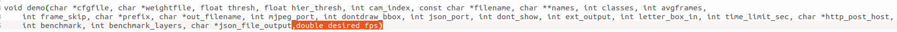
- Calculate Target Frame Time: Before the while loop at line 271, calculate the target frame time based on the FPS.

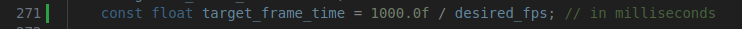
- Capture Time: After the while loop at line 274, add capture_time

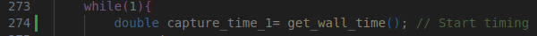
- Control FPS (Between Lines 376-382):Between lines 376 and 382, you'll need to add logic to ensure that the FPS is controlled by comparing the elapsed time with the target frame time.

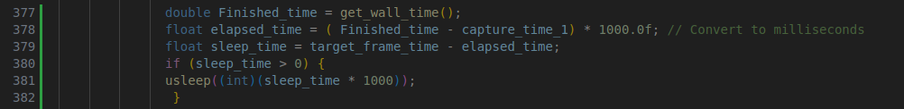
- Change the condition on line 413 to display the average FPS every second instead of a 3-second delay

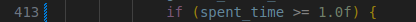
- **Changes to demo.h**
- In demo.h, modify the function declaration to include the  double desired_fps parameter at line 8

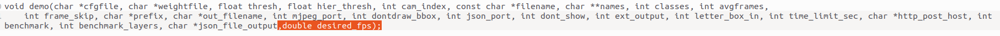
- **Changes to detector.c**
- Retrieve FPS Argument: Add the following code at lines 2021 and 2022 to retrieve the -fps argument from the command line

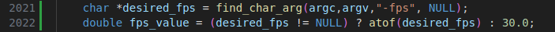
- Pass fps_value to demo(): Modify the call to demo() to pass the fps_value at lines 2041 and 2042

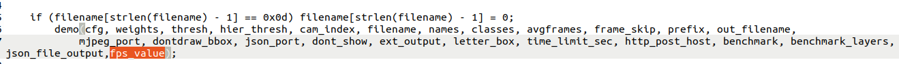

- **Changes to coco.c**
- Retrieve -fps Argument: Add the following code at lines 411 and 412 for coco.c to retrieve the -fps argument

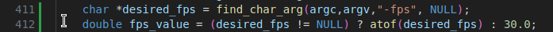

- Pass fps_value to demo(): Modify the call to demo() to pass the fps_value at lines 417 and 418 in coco.c

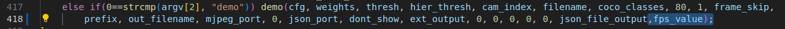

- **Changes to yolo.c**
- Retrieve -fps Argument: Add the following code at lines 365 and 366 for yolo.c to retrieve the -fps argument

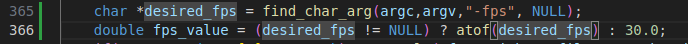

- Pass fps_value to demo(): Modify the call to demo() to pass the fps_value at lines 371 and 372 in yolo.c
   
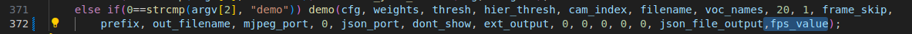

- **Build and Compile Darknet**

make clean
make -j8

- **verify modifications**

- **without fps argument**

./darknet detector demo cfg/coco.data cfg/yolov4.cfg yolov4.weights /home/xactai/Videos/Novotel_3mins_Video.mp4
    ```
If the changes are successful we can see the output

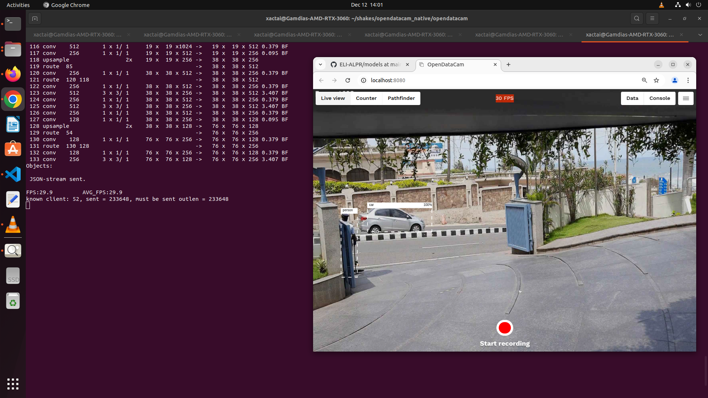

- **with fps argument**
```bash
./darknet detector demo cfg/coco.data cfg/yolov4.cfg yolov4.weights /home/xactai/Videos/Novotel_3mins_Video.mp4 -fps 30
```

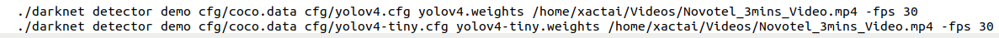

If the changes are successful we can see the output

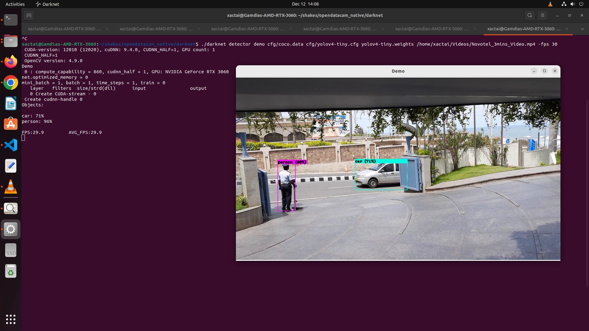

#### <font color=green><b> YOLOv4 can handle up to 45 FPS, but for 60 FPS, you may need to modify the yolov4.cfg file (e.g., reducing height and width to 416)</font></b>

- ### OpenDataCam Code Modifications

- **Changes to yolo.js**

- Declare new variable called ***fps*** and convert to float

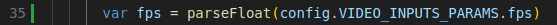

- Modify the darknet command and add ***fps*** so that darknet can run with desired fps set in [config](./config.json) file.

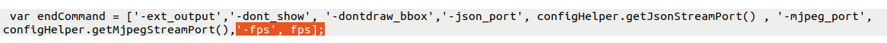

- **Changes to config.js**

- Need to add one new key called ***FPS*** and set the desired value.

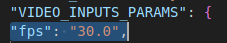

- **verify modifications**

- Once the modifications have been made in OpenDataCam and darknet is compiled with the above changes run the below commands to verify whether application is running successfully or not.

```bash
npm install
npm run build
npm run start
```
## 🔌 API Documentation

In order to solve use cases that aren't taken care by our opendatacam base app, you might be able to build on top of our API instead of forking the project.

[https://opendatacam.github.io/opendatacam/apidoc/](https://opendatacam.github.io/opendatacam/apidoc/)

## 🗃 Data export documentation

- [Counter data](https://opendatacam.github.io/opendatacam/apidoc/#api-Recording-Counter_data)
- [Tracker data](https://opendatacam.github.io/opendatacam/apidoc/#api-Recording-Tracker_data)

## 🎯 How accurate is OpenDataCam ?

Accuracy depends on which YOLO weights your hardware is capable of running.

We are working on [adding a benchmark](https://github.com/opendatacam/opendatacam/issues/87) to rank OpenDataCam on the [MOT Challenge (Multiple Object Tracking Benchmark)](https://motchallenge.net/)

## 🚤 How fast is OpenDataCam ?

FPS depends on:

- which hardware your are running OpenDataCam on
- which YOLO weights you are using

We made the default settings to run at least at 10 FPS on any Jetson.

Learn more in the [Customize OpenDataCam documentation](documentation/CONFIG.md#Change-neural-network-weights)

## 🛠 Development notes

See [Development notes](documentation/DEVELOPMENT_NOTES.md)

Technical architecture overview:


## 💌 Acknowledgments

- Original darknet @pjreddie  : [https://pjreddie.com/darknet/](https://pjreddie.com/darknet/)
- Darknet fork + YOLOv4 by @alexeyab : [https://github.com/alexeyab/darknet](https://github.com/alexeyab/darknet)
- IOU / V-IOU Tracker by @bochinski : [https://github.com/bochinski/iou-tracker/](https://github.com/bochinski/iou-tracker/)
- Next.js by @zeit : [https://github.com/zeit/next.js](https://github.com/zeit/next.js)


