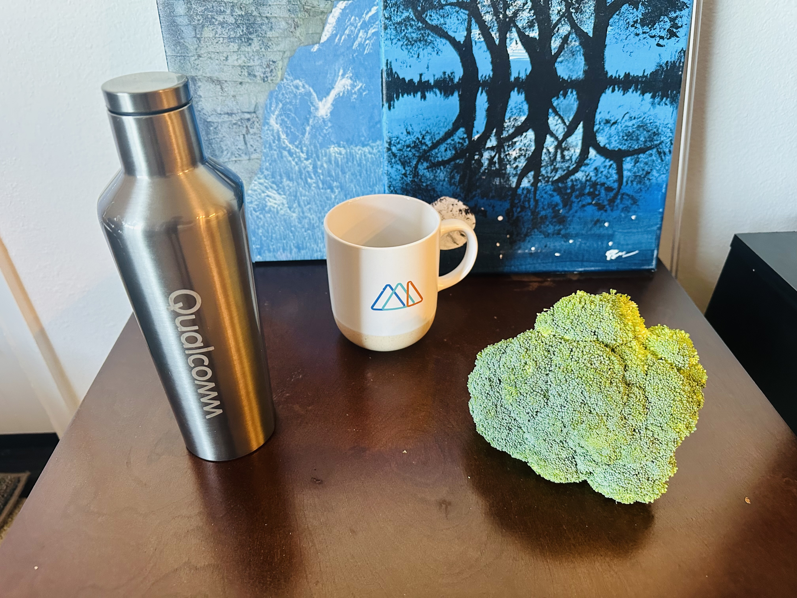
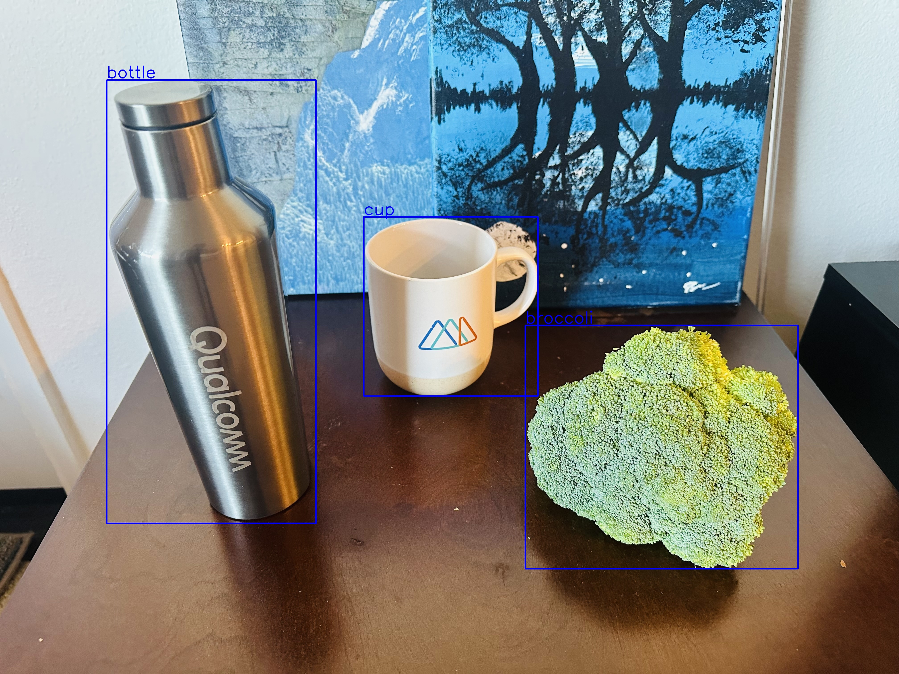

# Object Detection CLI application

Object Detection application for Windows on Snapdragon® with [Yolo-v8](https://aihub.qualcomm.com/compute/models/yolov8_det) using ONNX runtime.

The app demonstrates how to use the [QNN execution provider](https://onnxruntime.ai/docs/execution-providers/QNN-ExecutionProvider.html) to accelerate the model using the Snapdragon® Neural Processing Unit (NPU).

## Requirements

### Platform

- Snapdragon® Platform (e.g. X Elite)
- Windows 11+

### Tools and SDK

- Visual Studio 22
  - Make sure **Desktop development with C++ tools** are selected during installation or installed separately later
  - Download any variant of [Visual Studio here](https://visualstudio.microsoft.com/vs/)
- QNN SDK: [Qualcomm AI Engine Direct](https://qpm.qualcomm.com/#/main/tools/details/qualcomm_ai_engine_direct)
  - Download and install the latest Qualcomm AI Engine Direct SDK
  - Make libraries from `<QNN_SDK>/libs/<target_platform>` accessible to app target binary
    - Option 1: add `<QNN_SDK>/libs/<target_platform>` in $PATH environment variable
    - Option 2: copy libraries from `<QNN_SDK>/libs/<target_platform>` in same directory as executable
  - e.g. on Windows on Snapdragon®, `<QNN_SDK>/libs/aarch64-windows-msvc` or `<QNN_SDK>/libs/arm64x-windows-msvc` should be added in $PATH environment variable.

## Build App

### Downloading model from AI Hub

Download object detection [Yolov8 ONNX model from AI Hub](https://aihub.qualcomm.com/compute/models/yolov8_det) and place into `<project directory>/assets/models/` directory

### Build project in Visual Studio 22

1. Open `ObjectDetection.sln`
2. Setting up dependencies
   - NuGet packages
     - NuGet packages should automatically restore in Visual Studio during build
     - If packages are not restored automatically, try the following:
       - If prompted by Visual Studio to `restore` NuGet packages
         - Click on `restore` to restore all `NuGet` packages
       - Otherwise,
         - Go to `Project -> Manage NuGet packages` in Visual studio
         - Install [ONNX-Runtime-QNN](https://www.nuget.org/packages/Microsoft.ML.OnnxRuntime.QNN) 1.19.0

   - vcpkg packages
     - Project is configured to work with vcpkg in [manifest mode](https://learn.microsoft.com/en-us/vcpkg/concepts/manifest-mode)
     - If opencv headers are missing, vcpkg is not setup correctly.
     - [Integrate vcpkg]((https://learn.microsoft.com/en-us/vcpkg/commands/integrate#vcpkg-integrate-install)) with Visual Studio:
         - Go to `View -> Terminal` in Visual studio
         - Run the following command in terminal

         ```bash
         vcpkg integrate install
         ```

3. Build project in Visual Studio
   - It takes around 10 mins to build on X Elite.

## Running App

Please ensure you have followed [Downloading model from AI Hub](#downloading-model-from-ai-hub) section and placed [yolov8_det.onnx](https://aihub.qualcomm.com/compute/models/yolov8_det) into `.\assets\models\yolov8_det.onnx`

### Running via Visual Studio

Visual studio project is configured with the following command arguments:

```bash
--model .\assets\models\yolov8_det.onnx --image .\assets\images\kitchen.jpg
```

You can simply run the app from Visual Studio to run object detectionon sample image.

### Running app via CLI

```bash
.\ARM64\Debug\ObjectDetection.exe --model .\assets\models\yolov8_det.onnx --image .\assets\images\kitchen.jpg
```

You can additionally run `--help` to get more information about all available options:

```bash
.\ARM64\Debug\ObjectDetection.exe --help
```

Please refer to [QNN EP options](https://onnxruntime.ai/docs/execution-providers/QNN-ExecutionProvider.html#configuration-options) that can be provided as `--qnn_options` to the app.

### Sample Input



### Sample Output



## App and model details

1. Model input resolution: 640x640
    - If input image is of different shape, it's resized to 640x640
    - You can override model input dimensions if model uses different spatial image dimensions
2. App is built to work with post-processed outputs
    - App processes output logits and produces consumable output as follows:
        - Output boxes
        - Output scores
        - Output labels
    - If you want to try out any other model than Yolo (with post-processing included in model), please update output handling accordingly.

## FAQ

1. QNN SetupBackend failed:

   ```bash
   QNN SetupBackend failed: Unable to load backend, error: load library failed
   ```

   - QNN libraries are not set up correctly and at runtime backend libs were not found.
   - Please refer to [setting up QNN SDK](#tools-and-sdk) and ensure required libs are either in PATH environment variable or copied into target directory
2. How do I use a model with different input shape than 640x640?
   - Use `--model_input_ht` / `--model_input_wt` to model input dimensions.
3. I have a model that does not have post-processing embedded into the model. Can I still use the app?
   - You will have to modify the app and add the necessary post-processing to accommodate that models.

## Project setup

Following section describes how to configure similar project with NuGet and vcpkg from scratch:

1. Start empty Visual Studio project
2. Setup NuGet to install ONNXRuntime QNN Execution provider
   - Go to `Project -> Manage NuGet Packages`
   - Look up and install the following packages
     - [ONNX-Runtime-QNN](https://www.nuget.org/packages/Microsoft.ML.OnnxRuntime.QNN)
3. Set up Visual Studio for vcpkg
   - Enable vcpkg [manifest mode](https://learn.microsoft.com/en-us/vcpkg/concepts/manifest-mode)
      - Go to Project Setting
      - General -> vcpkg
      - Enable Manifest mode
   - Add `OpenCV` dependency in vcpkg
      - Run the following commands in Visual Studio powershell:

      ```bash
      vcpkg —new application
      vcpkg add port opencv
      ```

      This creates vcpkg.json and adds opencv depedency
4. Now project is setup to work with vcpkg and NuGet package manager
